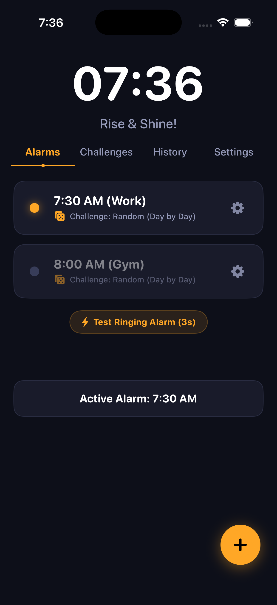
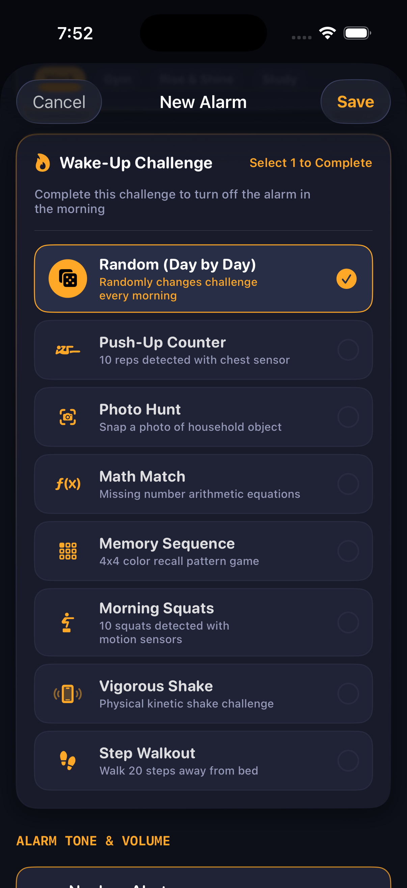
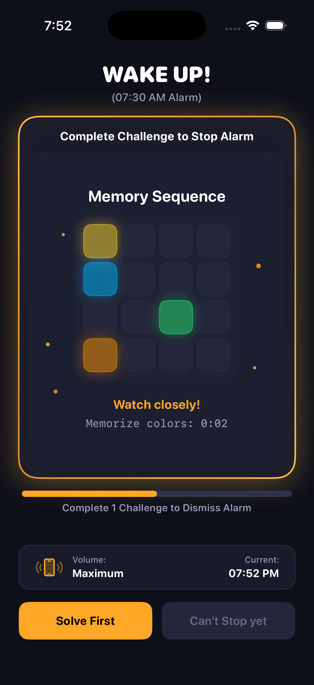
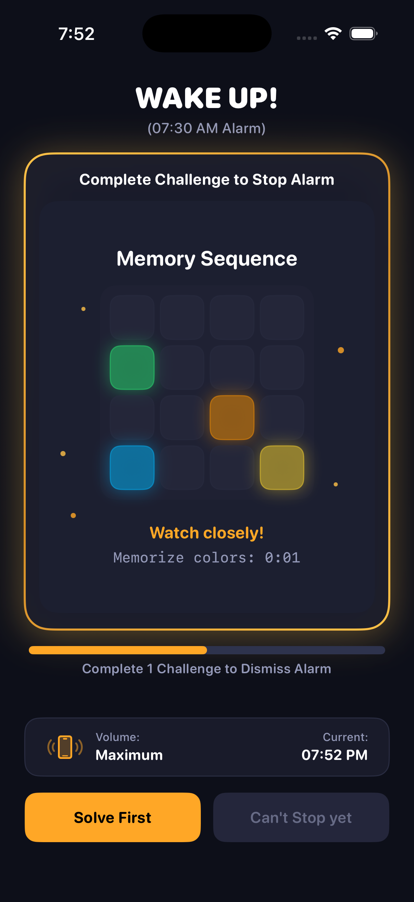
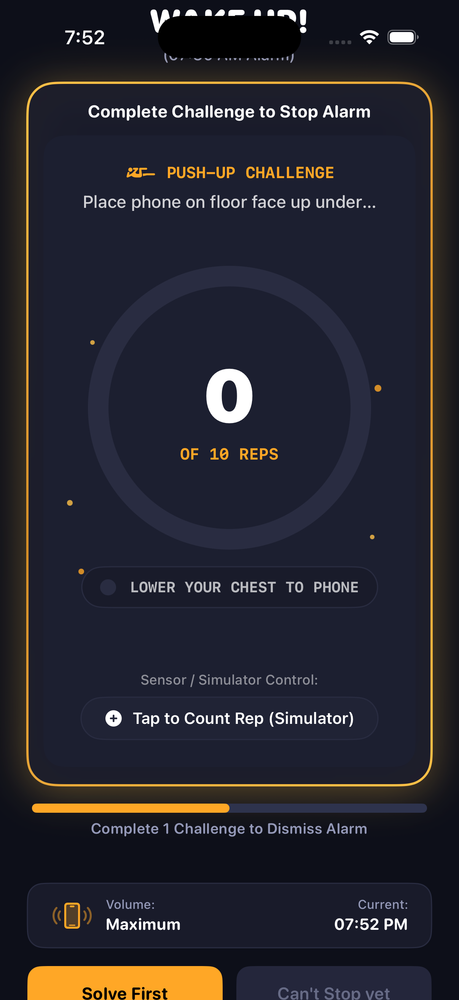
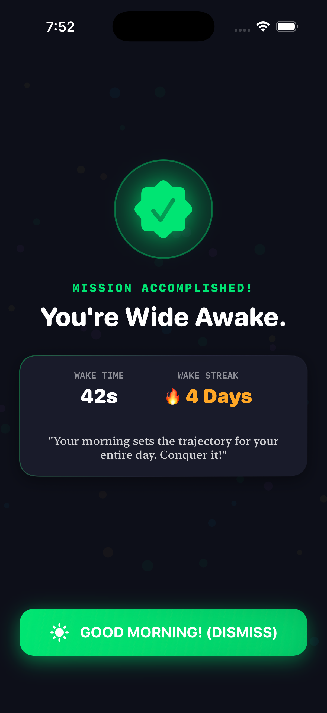
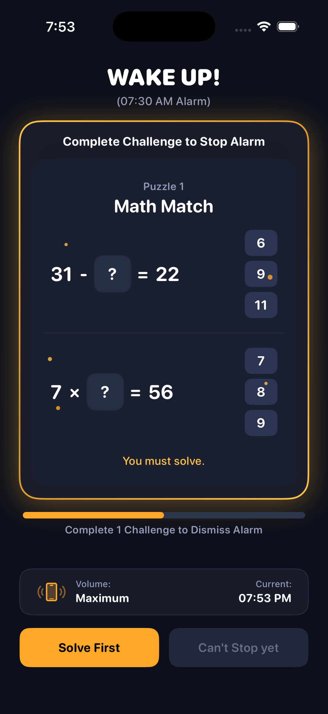
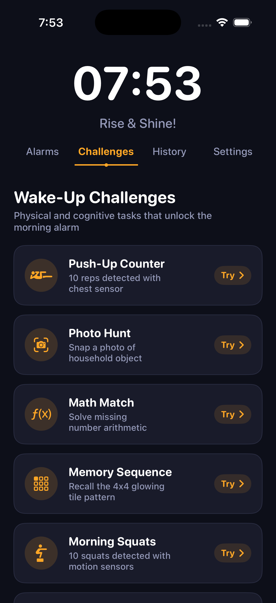

# HardAlarm: Wake-Up Challenges ⏰⚡

[](https://github.com/rwrife/hardalarm/actions/workflows/ci.yml)
[](https://developer.apple.com/ios/)
[](https://swift.org/)
[](https://developer.apple.com/xcode/)
[](docs/app_store/PRIVACY_POLICY.md)
[](LICENSE)

> **The uncompromising alarm clock built specifically for heavy sleepers, chronic snoozers, and anyone battling morning sleep inertia.**
> 
> HardAlarm changes the morning equation: the alarm will **NOT** turn off until you prove you are awake by solving a cognitive puzzle or completing a physical exercise mission.

---

## 📸 Screenshots

| 1. Dashboard & Alarms | 2. Challenge Selector | 3. Locked Alarm Ringing | 4. Memory Sequence |
| :---: | :---: | :---: | :---: |
|  |  |  |  |

| 5. Push-Up Mission | 6. Wake Celebration | 7. Math Match | 8. Challenges Catalog |
| :---: | :---: | :---: | :---: |
|  |  |  |  |

---

## 🧠 The Problem & The Science

Standard phone alarms make it dangerously easy to roll over, tap "Snooze" or "Stop" while half-asleep, and drift back into unconsciousness. This groggy transitional state is called **sleep inertia**—the prefrontal cortex remains partially dormant while motor centers can perform automated gestures.

**HardAlarm forces your nervous system to fully boot up:**
1. **Oxygen Surge (Physical Challenges)**: Bodyweight exercises like push-ups and squats elevate heart rate, pump oxygenated blood to the brain, and flood the system with morning cortisol and dopamine.
2. **Prefrontal Cortex Engagement (Cognitive Challenges)**: Arithmetic and working-memory matrix recall force your prefrontal executive networks to light up before silence is granted.
3. **Anti-Habituation (Day-by-Day Random Rotation)**: Rotating challenge types daily ensures you never build mindless muscle memory to dismiss alarms without waking up.

---

## ⚡ Wake-Up Challenges Catalog

When creating or editing an alarm, you select **exactly one challenge** or let HardAlarm choose a random one each day:

### 🏋️ Physical Missions
- **Push-Up Counter**: Place your iPhone face up on the floor beneath your chest. The front-facing proximity sensor and infrared detection count each honest rep down and up. Knock out 10 push-ups to silence the alarm.
- **Photo Hunt**: Forces you physically out of bed! Snap a live photo of a morning target item in your home (e.g. coffee mug, bathroom sink, shoes, water bottle, laptop, or book). Evaluated in real-time using on-device CoreML / Apple Vision classification.
- **Morning Squats**: CoreMotion accelerometer sensors monitor 10 deep squats, activating your body's largest muscle groups for an immediate adrenaline boost.
- **Step Walkout**: Integrated pedometer tracking requires you to stand up and take 20 continuous steps away from bed.
- **Vigorous Shake**: High-frequency kinetic acceleration meter requires continuous vigorous physical shaking to fill the progress gauge.

### 🧩 Cognitive Puzzles
- **Math Match**: Dynamically generated missing-operator, algebraic, and arithmetic equations with randomized numeric choices. Solves sleep inertia through quick mental calculation.
- **Memory Sequence**: A 4x4 matrix puzzle that flashes a vivid color sequence, conceals it, and asks you to tap the exact target tile from memory.

### 🎲 Random (Day-by-Day)
- Deterministically generates a different challenge every morning based on the calendar day. You wake up facing a surprise challenge so your brain can never anticipate or automate the dismissal routine.

---

## 🔊 Uncompromising Audio Engine

- **High-Decibel Synthetic Waveforms**: Procedurally generated 16-bit 44.1 kHz PCM audio buffers created in memory:
  - `Nuclear Klaxon` — Relentless industrial alternating emergency frequency
  - `Sub Bass Pulse` — Deep acoustic thrum designed to vibrate bedside surfaces
  - `Radar Pulse` — Piercing military radar frequency
  - `Digital Siren` — Fast-ramping dual-tone frequency modulation
  - `Strobe Alarm` — High-intensity rhythmic strobe pulse
  - `Matrix Sine` — Pure resonant sine tone at critical hearing sensitivity
- **Progressive Volume Ramping**: Optional gradual volume ramp from a faint whisper to maximum volume over 15 to 60 seconds.
- **Anti-Snooze Hardcore Mode**: Disable snooze completely. When the alarm triggers, completing your challenge is the only escape.

---

## 🔒 100% Private, On-Device & Offline

HardAlarm is architected with strict privacy guarantees:
- **No Cloud Synchronization**: All alarm configurations, streaks, and history live in local device storage.
- **No Third-Party Trackers or Analytics**: Zero telemetry, zero third-party tracking frameworks, zero advertising SDKs.
- **On-Device Vision & Motion Processing**: Camera frames captured during Photo Hunt and CoreMotion sensor data are analyzed in memory using Apple Neural Engine and immediately discarded. No images or sensor logs ever leave your device.
- See our complete [Privacy Policy](docs/app_store/PRIVACY_POLICY.md).

---

## 🛠️ Architecture & Tech Stack

| Component | Technology | Description |
| :--- | :--- | :--- |
| **Framework** | Native SwiftUI | Declarative iOS 26+ UI with dark obsidian neon theme |
| **Language** | Swift 6.0 | Modern Swift with Strict Concurrency & `@MainActor` safety |
| **Computer Vision** | Vision & CoreML | Real-time on-device object classification for Photo Hunt |
| **Motion Tracking** | CoreMotion | High-frequency accelerometer and pedometer sensor analysis |
| **Audio Engine** | AVFoundation | Procedural in-memory WAV buffer generation & playback |
| **Notifications** | UserNotifications | Background scheduled critical wake alerts |
| **Testing** | XCTest | Comprehensive unit test suite for alarms, audio, and missions |
| **CI / CD** | GitHub Actions & Fastlane | Automated PR testing and App Store Connect publishing |

---

## 🚀 Getting Started

### Prerequisites
- macOS 15+ (Sequoia) or macOS 16+
- Xcode 26.0+ with iOS 26.0+ SDK
- An active Apple Developer account (for physical device deployment and signing)

### Building Locally

1. **Clone the repository:**
   ```bash
   git clone https://github.com/rwrife/hardalarm.git
   cd hardalarm
   ```

2. **Open in Xcode:**
   ```bash
   open HardAlarm.xcodeproj
   ```

3. **Run Unit Tests via Command Line:**
   ```bash
   xcodebuild test \
     -project HardAlarm.xcodeproj \
     -scheme HardAlarm \
     -destination "platform=iOS Simulator,OS=latest,name=iPhone 17 Pro" \
     CODE_SIGNING_ALLOWED=NO
   ```

---

## 🚢 CI/CD & App Store Release Runbook

The project uses GitHub Actions and Fastlane for automated continuous integration and App Store delivery, matching the proven InfinityBall deployment pipeline.

### Workflows

- **`.github/workflows/ci.yml`**:
  - Triggers automatically on every pull request and push to `main`.
  - Spins up a macOS runner with Xcode 26, builds the project, and executes all unit tests.

- **`.github/workflows/ios-release.yml`**:
  - Manual trigger via `workflow_dispatch` (choice of `beta` for TestFlight or `release` for App Store submission) or automatic trigger when pushing a version tag (`v*`).
  - Automatically provisions code signing certificates via App Store Connect API keys.
  - Resolves next build number automatically from App Store Connect (`latest_testflight_build_number + 1`).
  - Exports signed IPA and uploads build artifacts with a 14-day retention window.

### Fastlane Lanes

```bash
# Upload build to TestFlight
fastlane ios beta

# Upload build and submit for App Store Review
fastlane ios release
```

### Required GitHub Secrets

| Secret | Description |
| :--- | :--- |
| `ASC_KEY_ID` | App Store Connect API Key ID (e.g. `2X9R4HXF34`) |
| `ASC_ISSUER_ID` | App Store Connect API Issuer UUID (e.g. `57246542-96fe-1a63-e053-0824d011072a`) |
| `ASC_KEY_P8` | The private `.p8` key contents or its base64 encoding |
| `ASC_TEAM_ID` | Apple Developer Team ID (`2ES87W257J`) |

---

## 📂 Repository Structure

```text
hardalarm/
├── .github/
│   └── workflows/
│       ├── ci.yml                 # PR & push test automation
│       └── ios-release.yml        # TestFlight & App Store release pipeline
├── docs/
│   └── app_store/
│       ├── APP_STORE_LISTING.md   # App Store copy, keywords, & submission guide
│       ├── PRIVACY_POLICY.md      # Full privacy policy
│       └── screenshots/           # Store screenshots (6.9", 6.3", and raw assets)
├── fastlane/
│   ├── Appfile                    # App bundle ID & Team configuration
│   ├── Fastfile                   # Fastlane automation lanes (beta, release)
│   └── metadata/en-US/            # App Store Connect metadata copy
├── HardAlarm/
│   ├── Assets.xcassets/           # App icon & color asset catalogs
│   ├── HardAlarmApp.swift         # SwiftUI app lifecycle entrypoint
│   ├── Models/
│   │   ├── Alarm.swift            # Alarm entity & day-by-day deterministic rotation
│   │   ├── AlarmSound.swift       # Synthetic alarm sounds & frequencies
│   │   ├── Mission.swift          # Physical & cognitive mission definitions
│   │   ├── Puzzle.swift           # Cognitive puzzle configuration
│   │   └── WakeRecord.swift       # Local stats & streak history models
│   ├── Services/
│   │   ├── AlarmManager.swift     # Alarm scheduling & persistence
│   │   ├── MotionManager.swift    # CoreMotion squats, shake, & step detection
│   │   ├── NotificationManager.swift # Local wake notifications
│   │   ├── SoundManager.swift     # Procedural PCM audio synthesizer
│   │   ├── SpeechManager.swift    # Morning voice briefings & speech synthesis
│   │   └── VisionManager.swift    # CoreML on-device photo object classification
│   ├── Theme/
│   │   └── Theme.swift            # Dark obsidian neon design system
│   └── Views/
│       ├── Components/            # Reusable UI cards, gauges, & buttons
│       ├── Editor/                # Alarm creator & challenge selector
│       ├── History/               # Wake streak tracker & statistics
│       ├── Main/                  # Dashboard, alarm list, & challenge preview
│       ├── Missions/              # Physical mission interfaces (Push-ups, Squats, Photo)
│       ├── Puzzles/               # Mental puzzle interfaces (Math Match, Memory Matrix)
│       ├── Ringing/               # Active ringing screen & celebration view
│       └── Settings/              # Audio preview & anti-snooze preferences
├── HardAlarmTests/
│   └── HardAlarmTests.swift       # Unit test suite
└── HardAlarm.xcodeproj/           # Xcode project configuration
```

---

## 📄 License

Distributed under the MIT License. See [LICENSE](LICENSE) for details.

Developed with discipline by **[InfinityBall](https://github.com/rwrife)**.
